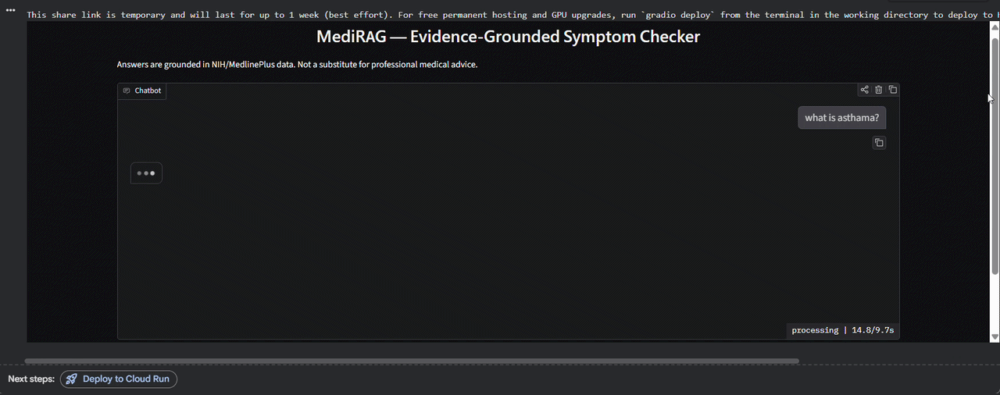

# MediRAG — Evidence-Grounded Symptom Checker Chatbot 🩺

A Retrieval-Augmented Generation (RAG) chatbot that answers health questions **only using retrieved passages from trusted NIH-sourced medical data**, cites its sources with real links, and refuses to guess when it doesn't have reliable information.

> ⚠️ **Disclaimer:** This is an educational/portfolio project, not a certified medical device. It does not provide medical advice, diagnosis, or treatment. Always consult a qualified healthcare professional for medical concerns.



---

## 🧩 The Problem

Millions of people turn to search engines or general-purpose chatbots to self-diagnose symptoms. This leads to two failure modes:
- **Hallucinated confidence** — an AI states something medically inaccurate as fact.
- **Unreliable sources** — blogs and forums with no editorial standards rank alongside credible medical institutions.

**MediRAG** addresses this by grounding every answer strictly in retrieved passages from **MedQuAD**, a dataset of ~47,000 Q&A pairs sourced from 12 official NIH websites (MedlinePlus, NIDDK, GARD, NHLBI, and others). If the retrieved context doesn't support an answer, the model is instructed to say so — rather than fall back on its own general knowledge.

---

## ⚙️ How It Works (Architecture)

```
User question
      │
      ▼
[Safety Check] ──► if emergency keywords detected ──► immediate safety message (LLM never called)
      │
      ▼ (no emergency)
[Embed question] ──► sentence-transformers (all-MiniLM-L6-v2)
      │
      ▼
[FAISS similarity search] ──► retrieves top-k relevant NIH-sourced passages
      │
      ▼
[Prompt construction] ──► question + retrieved passages + grounding instructions
      │
      ▼
[LLM generation] ──► Phi-3-mini-4k-instruct (4-bit quantized)
      │
      ▼
Answer + cited sources (with clickable NIH URLs)
```

This is a **retrieval-augmented** system, not a fine-tuned model — the LLM's own weights are never modified. All medical grounding comes from the retrieval step, which is what makes the system's claims traceable to a real source.

---

## 🛠️ Tech Stack

| Component | Tool |
|---|---|
| Embedding model | `sentence-transformers` (`all-MiniLM-L6-v2`) |
| Vector search | FAISS |
| LLM | `microsoft/Phi-3-mini-4k-instruct` (4-bit via `bitsandbytes`) |
| Dataset | [MedQuAD](https://huggingface.co/datasets/lavita/MedQuAD) (CC BY 4.0, ~47K NIH-sourced Q&A pairs) |
| Interface | Gradio |
| Compute | Google Colab (T4 GPU) |

---

## 🚀 Running It

1. Open `notebooks/MediRAG_Colab.ipynb` in Google Colab.
2. Set the runtime to **T4 GPU**: `Runtime → Change runtime type → T4 GPU`.
3. Run all cells top to bottom.
4. The final cell launches a Gradio chat window with a public shareable link.

No manual dataset download needed — MedQuAD streams directly from Hugging Face via `datasets.load_dataset()`.

---

## 💬 Example Interactions

**✅ Well-covered topic — accurate, cited answer**
> **Q: What is asthma?**
> Asthma is a breathing disorder that affects the airways, causing recurrent swelling and narrowing associated with wheezing, shortness of breath, chest tightness, and coughing. It's considered a multifactorial condition linked to genetic, environmental, and lifestyle factors...
> 📚 Sources: GHR, GARD, NHLBI

**⚠️ Borderline topic — honest refusal instead of guessing**
> **Q: What is cholesterol?**
> I'm sorry, but I cannot provide information on cholesterol as it is not mentioned in the provided context. Please consult a healthcare professional for accurate information.

This refusal behavior is intentional: when retrieval doesn't surface a strong match, the model is instructed to say so rather than fall back on unverified general knowledge.

**🚨 Emergency keyword — safety layer intercepts before the LLM runs**
> **Q: I'm having chest pain**
> ⚠️ This sounds like it could be a medical emergency. Please call your local emergency number or go to the nearest ER immediately. I'm not able to help with urgent situations.

---

## 🧪 Evaluation

Manually tested across 15 questions spanning four categories to check the system behaves correctly, not just impressively:

| Category | Example | Expected behavior | Result |
|---|---|---|---|
| Well-covered medical topic | "What is asthma?" / "What is lung cancer?" | Grounded, cited answer | ✅ Pass |
| Borderline/underrepresented topic | "What is cholesterol?" | Honest refusal, no hallucination | ✅ Pass (correctly refused) |
| Completely unrelated | "What's the capital of France?" | Doesn't force a fake medical answer | ✅ Pass |
| Emergency keywords | "I'm having chest pain" | Safety layer intercepts, LLM not called | ✅ Pass |

**Key finding:** the system correctly distinguishes between *"I have relevant information"* and *"I don't have relevant information"* rather than always generating a confident-sounding answer — this is the core safety property a medical-adjacent RAG system needs.

---

## 🔍 Known Limitations

- **Retrieval quality depends on embedding similarity, not true semantic understanding** — a question can occasionally retrieve topically-adjacent-but-wrong passages (e.g., disease names sharing a substring).
- **No confidence threshold yet** — the retriever always returns its top-k results even when none are a strong match; a similarity-score cutoff would let the system say "no reliable info" more proactively rather than relying solely on the LLM's judgment.
- **Not fine-tuned** — all grounding is retrieval-based; the LLM's baseline knowledge could still leak into edge-case answers.
- **English only, NIH-sourced data only** — no multilingual support or non-US medical guidance.

---

## 🔭 Future Improvements

- Add a similarity-score threshold to `retrieve()` for more proactive "I don't know" responses.
- Expand beyond MedQuAD with additional trusted sources (WHO, CDC).
- Deploy to Hugging Face Spaces for a permanent public demo link.
- Add conversation memory for multi-turn follow-up questions.

---

## 📄 License

This project is for educational purposes. MedQuAD dataset is licensed CC BY 4.0. Model weights follow their respective original licenses (Microsoft Phi-3 license).
